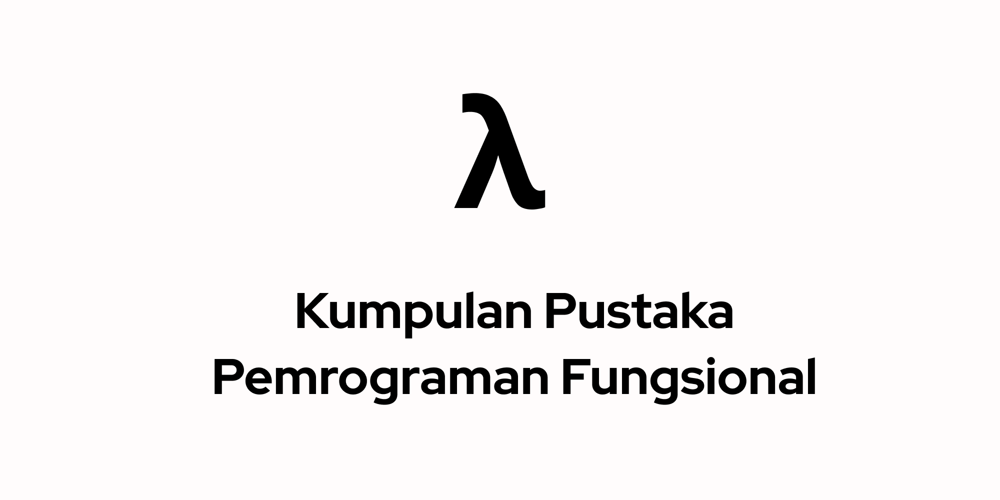

Selamat datang, Lambdaners.

Repositori ini didedikasikan menghimpun sumber daya seperti buku, tulisan dan video untuk berkenalan dengan pemrogram fungsional
pilihan kontributor baik dalam (terutama) Bahasa Indonesia atau lainya.

**Daftar Isi**

- <a href="#bahasa">Bahasa</a>
- <a href="#buku">Buku</a>
- <a href="#bahan-ajar">Bahan Ajar</a>
- <a href="#ekstensi-bahasa">Ekstensi Bahasa</a>
- <a href="#komunitas">Komunitas</a>
  - <a href="#telegram">Telegram</a>
- <a href="#tulisan">Tulisan</a>
- <a href="#video">Video</a>

## Tujuan

Repo ini dibangun untuk memudahkan kawan-kawan untuk mencari tutorial pemrograman fungsional dan mempelajarinya secara mendalam.

Serta, demi kebebasan informasi untuk edukasi dan pencerdasaan bersama.

```
Everyone should learn code, it teach how to think
- Steve Jobs (1955-2011)
```

## Tulisan
- [An introduction to typeclass metaprogramming](https://lexi-lambda.github.io/blog/2021/03/25/an-introduction-to-typeclass-metaprogramming/)
- [Beating the Average](http://www.paulgraham.com/avg.html)
- [Functor, Applicative, dan Monad dengan Gambar](https://andraaa.my.id/blog/functor-applicative-dan-monad-dengan-gambar/)
- [F# for fun and profit](https://fsharpforfunandprofit.com)
- [Jargon Pemrograman Fungisonal](https://github.com/wisn/jargon-pemrograman-fungsional)
- [Lambda Calculus, Tutorial Points](https://www.tutorialspoint.com/functional_programming/functional_programming_lambda_calculus.htm)
- [Monday Morning Haskell](https://mmhaskell.com/)
- [Paradigma Fungsional](https://kotakode.com/blogs/12746)
- [Pengenalan Paradigma Pemrograman Fungsional Praktis](https://medium.com/paradigma-fungsional/perkenalan-paradigma-pemrograman-fungsional-praktis-7bc5dce026b9)
- [Pengertian Lambda Kalkulus](http://martinalova98.blogspot.com/2013/12/pengertian-lambda-kalkulus.html)

## Bahasa

- [Clojure](https://clojure.org)
- [Common Lisp](https://common-lisp.net)
- [Elixir](https://elixir-lang.org)
- [Elm](https://elm-lang.org)
- [F#](https://fsharp.org)
- [Haskell](https://haskell.org)
- [Juniper](https://www.juniper-lang.org/)
- [OCaml](https://ocaml.org)
- [Racket](https://racket-lang.org/)
- [Rescript](https://rescript-lang.org)
- [Scala](https://www.scala-lang.org)

## Buku

- [Beautiful Racket](https://beautifulracket.com/)
- [Belajar Clojure](https://github.com/bepitulaz/BelajarClojure)
- [Dasar Haskell](https://haskell.web.id/static/dasar-haskell.pdf)
- [Diktat Dasar Pemrograman : Pemrograman Fungsional](http://www.buku-e.lipi.go.id/penulis/ingg001/1343696241buku.pdf)
- [Elm Programming](https://elmprogramming.com/)
- [OCaml From the Ground Up](https://ocamlbook.org/)
- [Pemrograman Fungsional untuk Rakyat Jelata dengan Scalaz](https://leanpub.com/fpmortals-id)
- [Learn You A Haskell](http://learnyouahaskell.com)
- [Real World Haskell](http://book.realworldhaskell.org/)
- [Real World OCaml](https://dev.realworldocaml.org/)
- [Write You a Haskell](http://dev.stephendiehl.com/fun/)

## Bahan Ajar

- [Functional Programming in OCaml: A Principled Approach](https://www.cs.cornell.edu/courses/cs3110/2021sp/textbook/)
- [Haskell Indonesia](https://haskell.web.id/lectures.html)
- [Pemrograman Fungsional, Open Course Ware Universitas Indonesia](https://ocw.ui.ac.id/course/view.php?id=143)

## Ekstensi Bahasa

- [fp-ts](https://github.com/gcanti/fp-ts)
- [functional-go](https://github.com/logic-building/functional-go)

## Komunitas

### Telegram

- [Clojure Indonesia](https://t.me/clojure_id)
- [Common Lisp Indonesia](https://t.me/lisp_id)
- [Elixir Indonesia](https://t.me/elixir_id)
- [Elm Indonesia](https://t.me/elmindonesia)
- [F# Indonesia](https://t.me/fsharp_id)
- [Haskell Indonesia](https://t.me/haskell_id)
- [OCaml Indonesia](https://t.me/ocamlid)
- [ReasonML ID](https://t.me/reasonML_id)
- [Scala ID](https://t.me/scala_id)

## Video
- [What is Functional Programming oleh Scott Murphy](https://www.youtube.com/watch?v=KHojnWHemO0)
- [Driving an FP-first company, with Serokell CEO Arseniy Seroka](https://www.youtube.com/watch?v=ZoiHKnVTvZ8)
- [Pengantar Kalkulus Lambda oleh Idiosemantik](https://www.youtube.com/watch?v=BinlkRGwf_I)


## Kontribusi

Silahkan buka di [CONTRIBUTION](./CONTRIBUTION.md)

## Lisensi

[Unlicense](./LICENSE)
